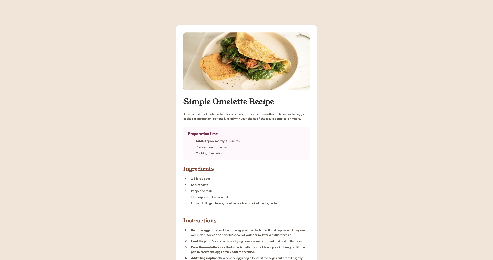

# Social Links Profile

This project is a responsive recipe page built with HTML and CSS, featuring a clean design and mobile-friendly layout. Includes structured content for ingredients, preparation steps, and nutritional information.

## Screenshots



## Demo

[View Live Project](https://4-recipe-page-beryl.vercel.app/)

## Project Structure

```
/recipe-page
├── assets/
│   ├── fonts/
│   ├── images/
│   ├── preview/
├── index.html
├── styles.css
├── README.md
```

## Technologies Used

- HTML5
- CSS3

## Installation & Usage

To run the project locally:

1. Clone the repository:
   ```sh
   git clone https://github.com/austin-jonas/4-recipe-page.git
   ```
2. Open index.html in a browser.